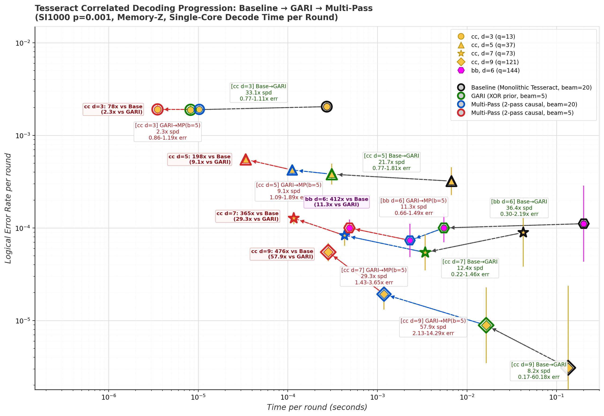
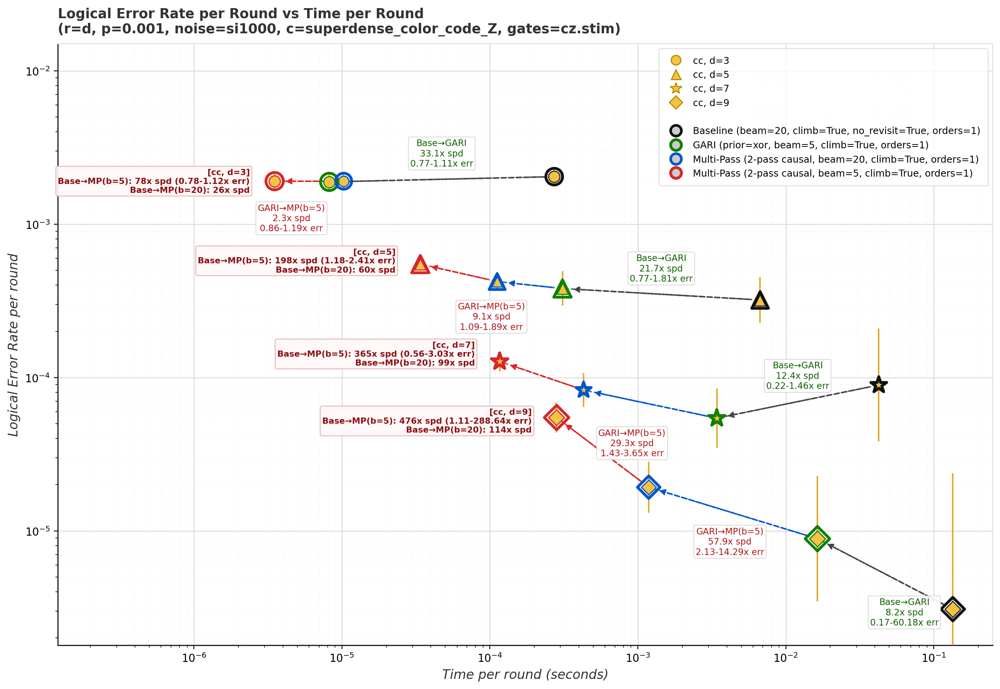
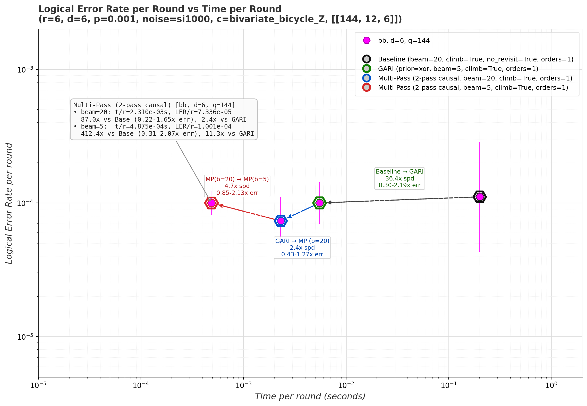

# Baseline → GARI → Multi-Pass Decoding Tradeoffs

This directory contains the benchmark scripts, results, and log–log tradeoff plots comparing **Logical Error Rate per Round** vs. **Decode Time per Round** across three stages of correlated decoding in Tesseract:

1. **Baseline (Monolithic Tesseract)**: `beam=20, beam_climbing=True, no_revisit_dets=True, num_det_orders=1`
2. **GARI**: `prior=xor, beam=5, beam_climbing=True, num_det_orders=1` via [`circuit_to_gari`](../../src/py/_tesseract_py_util/gari.py) and [`build_detector_orders`](../../src/py/_tesseract_py_util/gari.py)
3. **Multi-Pass**: 2-pass causal scheduling (`--multipass --num-passes 2 --multipass-strategy causal`) via [`MultiPassTesseractDecoder`](../../src/multi_pass/multi_pass_tesseract_decoder.h) and [`annotate_detector_bases`](../../src/py/_tesseract_py_util/detector_basis.py), evaluated at both `beam=20` and `beam=5` (`beam_climbing=True, no_revisit_dets=True, num_det_orders=1`)

---

## 1. Combined Progression (`Baseline → GARI → Multi-Pass`)



---

## 2. Superdense Color Codes (`d = 3, 5, 7, 9`, SI1000 `p = 0.001`, Memory-Z)



---

## 3. Bivariate Bicycle Code (`[[144, 12, 6]]`, `r = 6, d = 6, q = 144`, SI1000 `p = 0.001`, Memory-Z)



---

## 4. Benchmark Summary Table

| Circuit | Decoder Stage | Shots (`Errors`) | Time / Round (s) | LER / Round | Speedup vs. Baseline | Speedup vs. GARI |
| :--- | :--- | :---: | :---: | :---: | :---: | :---: |
| **`cc, d=3`** (`r=3, q=13`) | Baseline (`b=20`) | `30,000` (`183`) | `2.72e-04` | `2.04e-03` | `1.0x` | — |
| | GARI (`b=5`) | `50,000` (`282`) | `8.21e-06` | `1.89e-03` | `33.1x` | `1.0x` |
| | Multi-Pass (`2p, b=20`) | `50,000` (`285`) | `1.03e-05` | `1.91e-03` | `26.5x` | `0.80x` |
| | **Multi-Pass (`2p, b=5`)** | **`50,000` (`285`)** | **`3.51e-06`** | **`1.91e-03`** | **`77.5x`** | **`2.34x`** |
| **`cc, d=5`** (`r=5, q=37`) | Baseline (`b=20`) | `20,000` (`32`) | `6.71e-03` | `3.20e-04` | `1.0x` | — |
| | GARI (`b=5`) | `30,000` (`57`) | `3.10e-04` | `3.81e-04` | `21.7x` | `1.0x` |
| | **Multi-Pass (`2p, b=20`)** | **`100,000` (`211`)** | **`1.12e-04`** | **`4.23e-04`** | **`59.9x`** | **`2.76x`** |
| | **Multi-Pass (`2p, b=5`)** | **`150,000` (`411`)** | **`3.39e-05`** | **`5.49e-04`** | **`197.9x`** | **`9.14x`** |
| **`cc, d=7`** (`r=7, q=73`) | Baseline (`b=20`) | `8,000` (`5`) | `4.25e-02` | `8.93e-05` | `1.0x` | — |
| | GARI (`b=5`) | `50,000` (`19`) | `3.42e-03` | `5.43e-05` | `12.4x` | `1.0x` |
| | **Multi-Pass (`2p, b=20`)** | **`100,000` (`58`)** | **`4.30e-04`** | **`8.29e-05`** | **`98.9x`** | **`7.95x`** |
| | **Multi-Pass (`2p, b=5`)** | **`200,000` (`178`)** | **`1.16e-04`** | **`1.27e-04`** | **`364.9x`** | **`29.3x`** |
| **`cc, d=9`** (`r=9, q=121`) | Baseline (`b=20`) | `18,000` (`0`) | `1.35e-01` | `< 3.09e-06` | `1.0x` | — |
| | GARI (`b=5`) | `50,000` (`4`) | `1.64e-02` | `8.89e-06` | `8.2x` | `1.0x` |
| | **Multi-Pass (`2p, b=20`)** | **`150,000` (`26`)** | **`1.19e-03`** | **`1.93e-05`** | **`113.5x`** | **`13.8x`** |
| | **Multi-Pass (`2p, b=5`)** | **`150,000` (`74`)** | **`2.83e-04`** | **`5.48e-05`** | **`476.0x`** | **`57.9x`** |
| **`bb, d=6`** (`[[144,12,6]]`) | Baseline (`b=20`) | `6,000` (`4`) | `2.01e-01` | `1.11e-04` | `1.0x` | — |
| | GARI (`b=5`) | `50,000` (`30`) | `5.52e-03` | `1.00e-04` | `36.4x` | `1.0x` |
| | **Multi-Pass (`2p, b=20`)** | **`50,000` (`22`)** | **`2.31e-03`** | **`7.34e-05`** | **`87.0x`** | **`2.39x`** |
| | **Multi-Pass (`2p, b=5`)** | **`150,000` (`90`)** | **`4.88e-04`** | **`1.00e-04`** | **`412.4x`** | **`11.3x`** |

---

## 5. Reproducing the Benchmarks and Plots

From the repository root, a single command runs all 20 benchmark configurations, writes [`results.json`](results.json), and generates all three plots in [`plots/`](plots/):

```bash
# 1. Build the C++ binary and Python bindings
bazel build --jobs=1 //src:tesseract //benchmarking/sparsify_errors:plot

# 2. Run all benchmarks and generate plots in one execution
python3 benchmarking/multipass/run_benchmarks.py
```

To regenerate the plots from an existing [`results.json`](results.json) without re-running the benchmarks:

```bash
python3 benchmarking/multipass/make_plots.py
```
